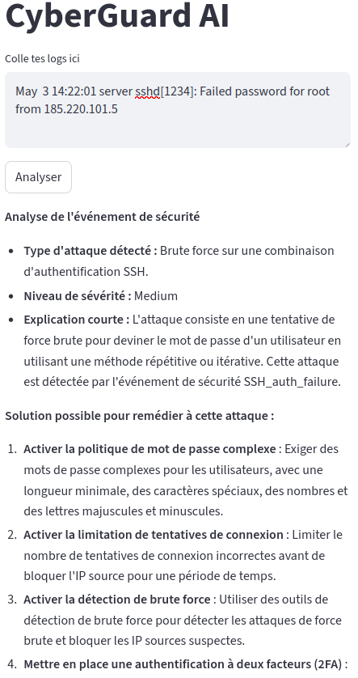
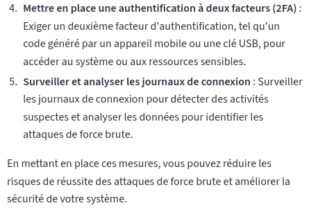

# CyberGuard AI

## C'est quoi
CyberGuard AI est un système multi-agents RAG orienté cybersécurité. 
Il ingère des logs de sécurité bruts, détecte les anomalies, interroge 
une base de connaissances MITRE ATT&CK via RAG (ChromaDB), et génère 
automatiquement un rapport d'incident grâce à un LLM.
## Architecture
.
├── agents
│   ├── analyzer.py
│   ├── collector.py
│   ├── __init__.py
│   ├── knowledge.py
│   └── reporter.py
├── app.py
├── chroma_db
│   ├── 2bfca99b-e35b-467a-859a-e9e0cede752c
│   │   ├── data_level0.bin
│   │   ├── header.bin
│   │   ├── length.bin
│   │   └── link_lists.bin
│   └── chroma.sqlite3
├── data
│   ├── logs
│   │   ├── parsed
│   │   └── raw
│   └── samples
├── knowledge
│   ├── chroma_db
│   │   └── chroma.sqlite3
│   ├── cve
│   ├── indexer.py
│   └──  mitre
│       └──  mitre_data.py
├── models
├── notebooks
├── README.md
├── reports
│   └── output
│       └── report.md
├── requirements.txt
├── scripts
└── tests
    ├── __init__.py
    ├── integration
    └── unit
        ├── __init__.py
        └── test_collector.py

## Stack technique
| Composant | Technologie |
|---|---|
| Agents | LangChain |
| LLM | Groq (llama-3.1-8b) |
| Base vectorielle | ChromaDB |
| Embeddings | all-MiniLM-L6-v2 |
| Interface | Streamlit |
| Tests | pytest (100% coverage) |
## Démo

L'utilisateur colle un log brut dans l'interface, clique sur **Analyser**, 
et obtient en quelques secondes une analyse complète enrichie par MITRE ATT&CK.

## Installation & lancement
# 1. Cloner le projet
git clone https://github.com/ton-username/cyberguard-ai
cd cyberguard-ai

# 2. Créer l'environnement virtuel
python3 -m venv .venv
source .venv/bin/activate

# 3. Installer les dépendances
pip install -r requirements.txt

# 4. Configurer les variables d'environnement
cp .env.example .env
# Éditer .env avec ta clé GROQ_API_KEY

# 5. Indexer la base de connaissances
python3 knowledge/indexer.py

# 6. Lancer l'interface
streamlit run app.py
## Auteure
ARDAN Fatima-azzahra